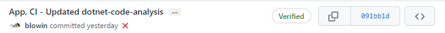

> Меня не пугают никакие действия, куда страшнее бездействие.
> 
> *Майкл Скофилд*

# Введение

Поговорим про [GitHub Actions](https://docs.github.com/en/actions), этот механизм позволяет выполнять огромное количество работы, включая CI/CD. 

CI/CD - это комбинация непрерывной интеграции (continuous integration) и непрерывного развертывания (continuous delivery или continuous deployment) программного обеспечения в процессе разработки. CI/CD объединяет разработку, тестирования и развёртывания приложения.(источник - Wiki)

Разберём, как можно настроить сборку и запуск тестов для .NET проекта, с использованием GitHub Actions.

# Проблема

Необходимо настроить автоматическую сборку проекта с последующим запуском тестов. 

Нужно запускать эти действия при коммите в репозиторий или создании pull request, чтобы обнаружить очевидные проблемы, не доходя до стадии code rewiew.

# Решение

Создадим GitHub Actions и опишем его в ручную.

```yaml
# Даём название нашему action'у
name: ci

# Указываем, на какие действия будет реагировать наш action
on:
  # Реагируем на пуш в любую ветку, при необходимости, это можно ограничить (см документацию)
  push:
    # не реагируем на изменение README.md
    paths-ignore:
    - 'README.md'
    
  # Реагируем на создание pull request
  pull_request:    
    # не реагируем на изменение README.md
    paths-ignore:
    - 'README.md'

jobs:
  build:
    # Запускаем наш action на последней версии ubuntu
    runs-on: ubuntu-latest

    # Описываем шаги нашего action'а
    steps:
      # Даём название (скачиваем актуальную версию нашего кода)
    - name: Checkout
      # Используем уже готовый action, из существует огромное количество, можно посмотреть тут https://github.com/marketplace?type=actions
      uses: actions/checkout@v2
      # Передаём параметры нашему actions/checkout@v2
      with:
        submodules: true
        fetch-depth: 0
        
    - name: Setup .NET
      # Устанавливаем на нашу ubuntu dotnet
      uses: actions/setup-dotnet@v1
      with:
        dotnet-version: '6.0.x'
        
      # Скачиваем зависимости, передав папку с sln файлом (делаем это отдельным действием, чтобы потом не делать это повторно для тестов)
    - name: Restore dependencies
      run: dotnet restore "src"
      
      # Собираем наш проект, указывая, что не нужно делать restore зависимостей
    - name: Build
      run: dotnet build "src/ProjectName" --no-restore

      # Запускаем тесты нашего проекта
    - name: Test
      run: dotnet test "src/ProjectName.Tests" --no-restore --verbosity normal

```

Вот и всё, наш action готов и теперь при создании коммита или pull request, мы будем видеть выполнились ли эти действия и как-то реагировать на них.

Рядом с коммитом можно увидеть статус выполнения. 

Так будет выглядеть успешное выполнение.


Так будет выглядеть выполнение с ошибкой.



# Итог

Была описана примитивная настройка github action, но уже она может очень помочь в разработке и упростить контроль кода в проекте. 

Мною описана лишь небольшая часть возможностей, для полного изучения github actions читайте документацию.

# Ссылки

* [GitHub Actions](https://docs.github.com/en/actions)
* [CI/CD](https://ru.wikipedia.org/wiki/CI/CD)