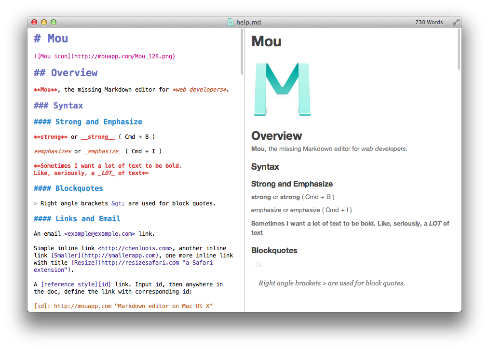

> Наводить порядок надо тогда, когда еще нет смуты.
> 
> *Лао-Цзы*

# Введение

Markdown — облегчённый язык разметки, созданный с целью обозначения форматирования в простом тексте, с максимальным сохранением его читаемости человеком и пригодный для машинного преобразования в языки для продвинутых публикаций (HTML, Rich Text и других). (источник - Wiki)

Сегодня Markdown является стандартом дефакто для ведения GitHub (файлы README.md) документации и всё больше проникает в нашу повсеместную жизнь. 

Для чего ещё используют Markdown:
* Ведения заметок 
* Генерации сайтов, [как этот](https://github.com/blowin/portfolio)
* Базы знаний [obsidian](https://obsidian.md/)

# Почему он так популярен?

Если коротко, то - простота. 

У Markdown простой [синтаксис](https://www.markdownguide.org/basic-syntax/) и его легко освоить каждому, огромное количество программных средств для редактирования и просмотра. 

Достаточно простого блокнота для редактирования md файлов и не обязательно устанавливать специальное программное обеспечение.

При необходимости файлы с разметкой можно экспортировать в pdf, html, word и т.д. 

# Расширения

Для Markdown существует множество расширений, что увеличивают возможности его использования. 

Например:
* [Математические формулы](https://marketplace.visualstudio.com/items?itemName=goessner.mdmath)
* [Диаграммы](https://chrome.google.com/webstore/detail/markdown-diagrams/pmoglnmodacnbbofbgcagndelmgaclel?hl=en) 
 
Как правило, они специфичны для конкретных редакторов. Можно открыть, к примеру, [плагины для Obsidian](https://obsidian.md/plugins).

# Итог

Markdown - простое и удобное средство для ведения документации, которое не зависит от конкретного программного обеспечения и может использоваться с любого устройства, так как является простым текстовым файлом.

# Ссылки

* [Markdown](https://ru.wikipedia.org/wiki/Markdown)
* [Syntax](https://www.markdownguide.org/basic-syntax/)