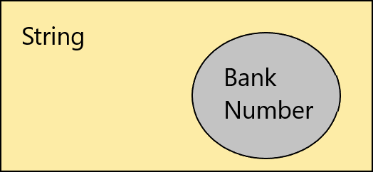

На протяжении всего своего пути в программировании я сталкиваюсь с проблемой повсеместного использования примитивных типов, они повсюду. 

Хотя мы и имитируем реальный мир, но мы раз за разом используем примитивные типы, для всего многообразия понятий, которые мы моделируем в коде. Эти понятия имеют больше ограничений, чем тип, который мы используем. Чтобы решить эту проблему, существует такое понятие как [Value Object](https://en.wikipedia.org/wiki/Value_object), оно отображает конкретное понятие с инкапсулированной логикой.

# Что не так с примитивами? 

Для примера возьмём банковский номер. Для его моделирования скорее всего мы будем использовать строку, хотя у нас есть определенные правила того, как он должен выглядеть. Например, формат номера должен иметь следующий вид: "123456789 1234567891 1234". 

То есть, он состоит из 3-х частей, разделенными пробелами, каждая из которых содержит только определенное количество цифр. Да, в реальности правил будет куда больше, но давайте для простоты оставим так.



Получается, что наш Bank Number является частью String, но он является только определенным подмножеством строки. 

В чём могут быть проблемы, при использовании строки в качестве банковского номера?

* Строка может бесконечно разной, иметь любую длину, быть null, иметь любые символы в любой последовательности.
* Везде, где нам будут передавать строку в качестве номера, нам придётся валидировать, так как мы не можем знать точно, является ли эта строка валидной.
* Нужно дублировать логику обработки нашего номера.
* Скорее всего мы захотим удалить пробелы в начале и в конце строки и если после этого удаления, строка будет содержать корректный номер, то мы хотим с ним работать.
* Мы не можем связать логику работы номера со строкой.

# Пример

```csharp
public class BankAccount
{
    private decimal _balance;
    private readonly string _number;
    
    public BankAccount(decimal balance, string number)
    {
        if(_balance < 0)
            throw new ArgumentException("Balance cannot be negative");
        if(string.IsNullOrEmpty(_number))
            throw new ArgumentException("Number cannot be empty");
        if(!IsValidNumber(number))
            throw new ArgumentException("Number is not valid");
        
        _balance = balance;
        _number = number;
    }

    public void Transfer(BankAccount destination, decimal amount)
    {
        if (destination == null)
            throw new ArgumentNullException(nameof(destination));
        if (amount < 0)
            throw new ArgumentException("Amount cannot be negative");
        if (_balance < amount)
            throw new ArgumentException("From account does not have enough money");
        
        _balance -= amount;
        destination._balance += amount;
    }

    private static bool IsValidNumber(string number)
    {
        var parts = number.Split(' ');
        var partMaxLength = new[] { 9, 10, 4 };
        
        if(parts.Length != partMaxLength.Length)
            return false;
        
        if (partMaxLength.Where((t, i) => parts[i].Length != t).Any())
            return false;
        
        return parts.SelectMany(e => e).All(char.IsDigit);
    }
}
```

BankAccount содержит 2 поля. Обратите внимание на метод Transfer, так как у нас нет понятия деньги, то нам приходится везде дублировать логику проверки, что они не являются отрицательными, такой логики может быть куда больше и мы можем забыть её реализовать. 

У нас может возникнуть необходимость создавать транзакции в типе и писать в неё номер счёта. Да, при создании транзакции из BankAccount, мы знаем, что там корректный номер, но скорее всего будут и другие места их создания и мы вряд ли хотели бы хранить ошибочные номера счетов. Тогда мы захотим продублировать эту логику в конструкторе или сделать статический метод 'Helper'.


# Используем Value Object

Будем использовать [Record struct](https://docs.microsoft.com/en-us/dotnet/csharp/language-reference/proposals/csharp-10.0/record-structs), для реализации Value Object. 

## Важно

Чтобы разные инстансы Value Object вели себя как обычные примитивы. То есть, они должны быть равны в случае равенства всех полей, реализовывать **GetHashCode**, чтобы их можно было совместно использовать с коллекциями. Правильно будет вместе с **Equals** перегрузить операторы сравнения. 

При использовании **record**, всё необходимое уже реализовано. Если же мы будем использовать простой класс или структуру, это необходимо сделать самостоятельно.

## Реализуем Money и BankAccountNumber

```csharp
public record struct Money
{
    public decimal Amount { get; }
    
    public Money(decimal amount)
    {
        if (amount < 0)
            throw new ArgumentException("Amount cannot be negative");
        Amount = amount;
    }
    
    public static bool operator<(Money left, Money right) => left.Amount < right.Amount;
    public static bool operator<=(Money left, Money right) => left.Amount <= right.Amount;
    public static bool operator>(Money left, Money right) => left.Amount > right.Amount;
    public static bool operator>=(Money left, Money right) => left.Amount >= right.Amount;
    public static Money operator-(Money left, Money right) => new Money(left.Amount - right.Amount);
    public static Money operator+(Money left, Money right) => new Money(left.Amount + right.Amount);
}

public record struct BankAccountNumber
{
    public string Number { get; }

    public BankAccountNumber(string number)
    {
        if(string.IsNullOrWhiteSpace(number))
            throw new ArgumentException("Number cannot be empty");
        
        var trimNumber = number.Trim();
        if(!IsValidNumber(trimNumber))
            throw new ArgumentException("Number is not valid");
        Number = trimNumber;
    }
    
    private static bool IsValidNumber(string number)
    {
        var parts = number.Split(' ');
        var partMaxLength = new[] { 9, 10, 4 };
        
        if(parts.Length != partMaxLength.Length)
            return false;
        
        if (partMaxLength.Where((t, i) => parts[i].Length != t).Any())
            return false;
        
        return parts.SelectMany(e => e).All(char.IsDigit);
    }
}
```

BankAccountNumber нормализует входящую строку и приводит её к нормальному виду, удаляя пробелы. Для Money мы добавили математические операции, чтобы он вёл себя как простое число. Благодаря тому, что это отдельные типы, легко можно добавлять логику.

Теперь BankAccount будет выглядеть следующим образом:

```csharp
public class BankAccount
{
    private Money _balance;
    private readonly BankAccountNumber _number;
    
    public BankAccount(Money balance, BankAccountNumber number)
    {
        _balance = balance;
        _number = number;
    }

    public void Transfer(BankAccount destination, Money amount)
    {
        if (destination == null)
            throw new ArgumentNullException(nameof(destination));
        if (_balance < amount)
            throw new ArgumentException("From account does not have enough money");
        
        _balance -= amount;
        destination._balance += amount;
    }
}
```

Теперь конструктор делает простые присваивания полей и не содержит проверок.

# Информативность ошибок

Чтобы не бросать исключения из конструктора и сделать их понятными для пользователей и разработчиков, стоит использовать фабричные методы. Давайте изменим BankAccountNumber с использованием этого подхода и [Result](https://adambennett.dev/2020/05/the-result-monad/) из [CSharpFunctionalExtensions](https://www.nuget.org/packages/CSharpFunctionalExtensions/)

```csharp
public record struct BankAccountNumber
{
    public string Number { get; }

    private BankAccountNumber(string number) => Number = number;

    public static Result<BankAccountNumber> TryCreate(string number)
    {
        if(string.IsNullOrWhiteSpace(number))
            return Result.Failure<BankAccountNumber>("Number cannot be empty");
        
        var parts = number.Trim().Split(' ');
        var partMaxLength = new[] { 9, 10, 4 };
        
        if(parts.Length != partMaxLength.Length)
            return Result.Failure<BankAccountNumber>("Number should contain 3 parts");
        
        if (partMaxLength.Where((t, i) => parts[i].Length != t).Any())
            return Result.Failure<BankAccountNumber>("Number parts should have 9, 10, 4 digits");
        
        if(!parts.SelectMany(e => e).All(char.IsDigit))
            return Result.Failure<BankAccountNumber>("Number should contain only digits");

        var validNumber = string.Join(" ", parts);
        return Result.Success(new BankAccountNumber(validNumber));
    }
}
```

Теперь создать наш BankAccountNumber можно только используя метод **Result<BankAccountNumber> TryCreate(string number)**. Который делает все необходимые проверки и возвращает ошибку, если на каком-то из шагов что-то пошло не так, не выбрасывая исключение.

Этот подход прекрасно работает c EF. Конфигурация может выглядеть следующим образом:

```csharp
// Делаем публичным свойством
modelBuilder.Entity<BankAccount>()
            .Property(e => e.Number)
            .HasConversion(number => number.Number, numberAsStr => BankAccountNumber.TryCreate(numberAsStr).Value);
```


# Итог

Не стоит боятся добавлять новые типы, часто это принесет куда больше пользы в будущем, чем использование примитивов.

# Ссылки

* [Record struct](https://docs.microsoft.com/en-us/dotnet/csharp/language-reference/proposals/csharp-10.0/record-structs)
* [Value Object](https://en.wikipedia.org/wiki/Value_object)
* [Result](https://adambennett.dev/2020/05/the-result-monad/)
* [CSharpFunctionalExtensions](https://www.nuget.org/packages/CSharpFunctionalExtensions/)