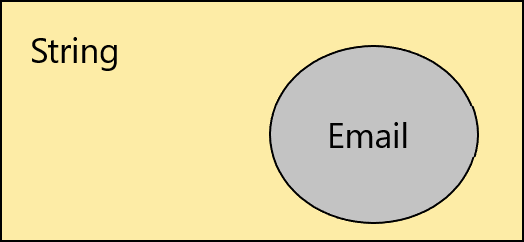

> Вот так и впадают в заблуждение — уменьшая значимость важных вещей.
> 
> *Настоящий детектив*
Р
# Введение

Сегодня поговорим о таком понятии как 'Value Object'. VO часто используется в [Domain Driven Design (DDD)](https://en.wikipedia.org/wiki/Domain-driven_design).

[Value Object](https://en.wikipedia.org/wiki/Value_object#:~:text=In%20computer%20science%2C%20a%20value,money%20or%20a%20date%20range.) - это небольшой объект, представляющий простую сущность, равенство которой не основано на идентичности: т.е. два объекта значений равны, когда они имеют одинаковое значение, не обязательно являясь одним и тем же объектом. (Далее VO)

Отличительные черты VO:
1. Не имеет уникального идентификатора. (определяется совокупностью полей)
2. Неизменяемый.
3. Два VO с одинаковыми полями равны. (равенство не по reference, а по значениям)
4. Может в себе содержать другие VO, но ни в коем случае не Entity (объекты с уникальностью по Id, они как правило изменяемые).

## Не имеет уникального идентификатора

Для записей в базу мы генерируем уникальный идентификатор и даже, если у двух строк поля будут равны, уникальность строки определяется по [primary key](https://en.wikipedia.org/wiki/Primary_key). В случае VO это не так, уникальность определяется по всем полям. Поэтому сравнение производится по значению, а не по ссылке.

## Сравнение по значению

Два объекта равны, если все их поля равны. Благодаря этому свойству их можно [кэшировать](https://ru.wikipedia.org/wiki/%D0%9A%D1%8D%D1%88), это возможно так как VO неизменяемы.

## Почему не использовать примитивные типы? 

* Примитивные значения имеют большой диапазон доступных значений.
* Наш VO может представляться совокупностью полей. Например, adress.
* Мы не можем добавить какую-то логику работы.
* Валидации, мы контролируем состояние нашего объекта.

К примеру нам необходимо представить email в приложении. Остановись на 5 минут и подумай "как бы я описал это в коде".

Многие использовали просто строку для этого, но в строке есть большое количество проблем, одна из которых - она обладает огромным диапазон возможных значений. В нашем случае нам интересны только строки в определенном формате. Т.е email, это всего лишь подмножество бесконечных возможных сочетаний строки. Наверняка у нас он ещё должен иметь определенную длину.



# Способы реализации

Для создания VO, можно использовать record, он уже из коробки генерирует основной код, для VO. Если нам не доступен функционал record, то мы можем реализовать это в ручную. Сейчас это не проблема, когда среда разработки помогает сгенерировать необходимый код.

В качестве VO можно использовать как класс, так и структуру. Если вы боитесь большого количества аллокаций, то структура отличный кандидат, для использования его в качестве VO.

```csharp
// Реализуем с помощью record
public record struct Email
{
    private static readonly Regex Regex = new Regex(@"^([\w\.\-]+)@([\w\-]+)((\.(\w){2,3})+)$", RegexOptions.Compiled);

    public string Value { get; }

    public Email(string value)
    {
        ArgumentNullException.ThrowIfNull(value);
        var email = value.Trim();

        var match = Regex.Match(email);
        if (!match.Success)
            throw new ArgumentException("Invalid email format");

        Value = email;
    }
}

// Без record
public readonly struct Email : IEquatable<Email>
{
    private static readonly Regex Regex = new Regex(@"^([\w\.\-]+)@([\w\-]+)((\.(\w){2,3})+)$", RegexOptions.Compiled);

    public string Value { get; }

    public Email(string value)
    {
        ArgumentNullException.ThrowIfNull(value);
        var email = value.Trim();

        var match = Regex.Match(email);
        if (!match.Success)
            throw new ArgumentException("Invalid email format");

        Value = email;
    }

    public bool Equals(Email other) => Value == other.Value;

    public override bool Equals(object? obj) => obj is Email other && Equals(other);

    public override int GetHashCode() => Value.GetHashCode();

    public override string ToString() => Value;

    public static bool operator ==(Email left, Email right) => left.Equals(right);
    public static bool operator !=(Email left, Email right) => !(left == right);
}
```

При необходимости можно делать фабричный метод для создания VO и он может возвращать Result\<T\>, если хотите как-то обрабатывать эти ситуации, например, для отображения сообщения пользователю.

# DateTime

DateTime является образцовым VO. Представь, если бы в стандартной библиотеке не было структуры DateTime. Нам пришлось бы постоянно ~~писать велосипед~~ работать с int, создавать несколько отдельных полей для удобства работы. Писать алгоритмы работы по преобразованию чисел в дату, добавлением минут, секунд и всему тому, что нам нужно повсеместно в этом типе. Это было бы ужасно.

К счастью разработчики стандартной библиотеки позаботились и нам доступен DateTime.

# Персистентность

Этот подход не будет проблемой при использовании его совместно с EF. Для этого существуют механизмы [Value conversions](https://docs.microsoft.com/en-us/ef/core/modeling/value-conversions?tabs=data-annotations) и [Owned Types](https://docs.microsoft.com/en-us/ef/core/modeling/owned-entities).

# Итог

Не нужно боятся создавать новые типы, это поможет упростить код и сделать его более понятным. 

К тому же мы получаем за бесплатно постоянно валидный объкт, что помогает избежать огромных пластов проверок и возможности привести его в неправильно состояние из произвольного места вашего кода.

# Ссылки

* [DateTime](https://github.com/microsoft/referencesource/blob/master/mscorlib/system/datetime.cs)
* [Value Object](https://en.wikipedia.org/wiki/Value_object#:~:text=In%20computer%20science%2C%20a%20value,money%20or%20a%20date%20range.)
* [Primary key](https://en.wikipedia.org/wiki/Primary_key)
* [Кэш](https://ru.wikipedia.org/wiki/%D0%9A%D1%8D%D1%88)
* [Domain Driven Design (DDD)](https://en.wikipedia.org/wiki/Domain-driven_design)
* [Implement value objects(Microsoft)](https://docs.microsoft.com/en-us/dotnet/architecture/microservices/microservice-ddd-cqrs-patterns/implement-value-objects)
* [Value conversions](https://docs.microsoft.com/en-us/ef/core/modeling/value-conversions?tabs=data-annotations)
* [Owned Types](https://docs.microsoft.com/en-us/ef/core/modeling/owned-entities)
